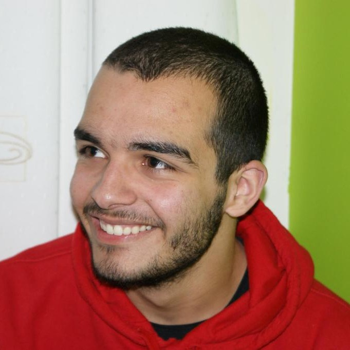

# Who am I?

{: style="height:250px"}

|Name| **Diogo Daniel Soares Ferreira**|
|Job| **Data Scientist**|
|Education| **Master in Computer and Telematics Engineering (Aveiro University, 2014-2019)** {: style="display:inline; height:50px"}|
|Birthday date| **February 3rd, 1997 (22 years old)**|
|Location| **Oliveira do Bairro, Aveiro**|

Hi! I'm Diogo Ferreira and I love to use and learn about machine learning techniques, mainly Deep Learning. I have finished my Masters in Computer and Telematics Engineering, with a thesis about forecasting techniques in 5G networks and its implementation to improve the network behavior (with a 20/20 grade).

I have done online courses to lear more about machine learning, such as the Machine Learning course by Andrew Ng in Coursera, and the Deep Learning Specialization, by Deep Learning.ai.

Beyond the digital world, I am also passionate about music, having attended several music summer festivals in the past years. I also enjoy sports, having played football for 12 years.

Finally, I am also a member of the Portuguese Scouts (CNE), being a candidate to scout leader.

Check my CV **[here](../assets/pdf/CV.pdf)**!
