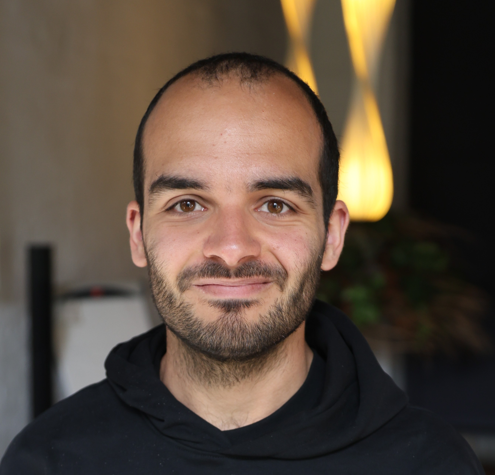

  

    <strong>Diogo Daniel Soares Ferreira</strong>
  

  

    🇧🇪 <strong>Living in Oostende, Belgium</strong>
    🇵🇹 <strong>From Aveiro, Portugal</strong>
  

  

    💼 <strong>Software Engineer @</strong>
    
  

  

    🎓 <strong>Master in Computer and Telematics Engineering</strong>
  

  

    <strong>University of Aveiro (2014–2019)</strong>
    
  

Software Engineer with 6+ years of experience building scalable, distributed systems in the cloud. I specialize in Java, Kotlin and Python, and have a strong focus on clean architecture, observability and reliability at scale.

When I'm not coding, I may be reading (check out my Goodreads <a href="https://www.goodreads.com/review/list/142999797?shelf=read">{: style="display:inline; height:20px"}</a>) or running (check out my Strava <a href="https://www.strava.com/athletes/67910674">{: style="display:inline; height:20px"}</a>).

I am also a big enthusiast of the <a href="https://en.wikipedia.org/wiki/FIRE_movement">FIRE</a> movement and of financial literacy.

Check my CV **[here](../assets/pdf/CV.pdf)**!

## Experience

|**Software Engineer** {: style="display:inline; height:30px"}|
|**12/23 -** \| **Remote (Belgium)**|
|Early engineer on the Platform team (second hire), built the platform from scratch for scheduling optimization workloads (e.g. employee shifts, vehicle routing).

Designed and implemented core backend systems using Java and Quarkus.

Deployed and operated workloads on Kubernetes across AWS, Azure, and GCP, enabling customers to run complex planning jobs efficiently at scale.|

---

|**Software Engineer** {: style="display:inline; height:30px"}|
|**11/21 - 11/23** \| **Remote (Portugal)**|
|Built and maintained event-driven microservices for brands like Betfair, PaddyPower and FanDuel within Flutter Entertainment, a large-scale global organization.

Worked with Java, Kotlin and Scala, using Akka, Kafka, Spring and Flink to ensure scalable and observable systems in a high-traffic environment.|

---

|**Software Engineer** {: style="display:inline; height:25px"}|
|**09/19 - 11/21** \| **Remote (Portugal)**|
|Developed data-driven backend services using Java, Quarkus, and Apache Camel.

Built robust pipelines on AWS, processing 4M+ events daily with a focus on reliability, monitoring, and scalability.|

---

|**Student Researcher** {: style="display:inline; height:30px"}|
|**10/17 - 08/19** \| **Aveiro, Portugal**|
|Design and implementation of a distributed real-time architecture to forecast anomalies using machine learning techniques and act on the network to improve the quality of service.
 
Develop a platform with support for management, monitoring, alerts and actuation over the data of a city, in real-time (smart city) using Python and Django.|

---

|**Summer Internship** {: style="display:inline; height:30px"}|
|**07/16 - 08/16** \| **Lisbon, Portugal**|
|Design and build a software with the purpose of finding apps in the Aptoide Store with explicit content using Python and Machine Learning techniques, with accuracy greater than 95%.|

---

## Publications

|**Prediction of Low Acessibility in 4G Networks** [PDF](../assets/pdf/paper5.pdf)|
|Diogo Ferreira, Carlos Senna, Paulo Salvador, Luís Cortesão, Cristina Pires, Rui Pedro, Susana Sargento|
|Annals of Telecommunications, May 2021|
|DOI: [10.1007/s12243-021-00849-9](https://doi.org/10.1007/s12243-021-00849-9)|

|**A Forecasting Approach to Improve Control and Management for 5G Networks** [PDF](../assets/pdf/paper4.pdf)|
|Diogo Ferreira, André Braga Reis, Carlos Senna, Susana Sargento|
|IEEE Transactions on Network and Service Management, February 2021|
|DOI: [10.1109/TNSM.2021.3056222](https://doi.org/10.1109/TNSM.2021.3056222)|

|**Distributed Real-time Forecasting Framework for IoT Network and Service Management** [PDF](../assets/pdf/paper3.pdf)|
|Diogo Ferreira, Carlos Senna, Susana Sargento|
|IEEE/IFIP Symposium Network Operations and Management (NOMS), Budapest, Hungary, April, 2020|
|DOI: [10.1109/NOMS47738.2020.9110456](https://doi.org/10.1109/NOMS47738.2020.9110456)|

|**Root Cause Analysis of Reduced Accessibility in 4G Networks** [PDF](../assets/pdf/paper2.pdf)|
|Diogo Ferreira, Carlos Senna, Paulo Salvador, Luís Cortesão, Cristina Pires, Rui Pedro, Susana Sargento|
|Machine Learning for Networking. MLN 2019. Lecture Notes in Computer Science, vol 12081. Springer, Cham|
|DOI: [10.1007/978-3-030-45778-5_9](https://doi.org/10.1007/978-3-030-45778-5_9)|

|**Breaking Text-Based CAPTCHA with Sparse Convolutional Neural Networks** [PDF](../assets/pdf/paper.pdf)|
|Diogo Daniel Ferreira, Luís Leira, Petya Mihaylova, Petia Georgieva|
|IbPRIA 2019: Pattern Recognition and Image Analysis pp 404-415|
|DOI: [10.1007/978-3-030-31321-0_35](https://doi.org/10.1007/978-3-030-31321-0_35)|
